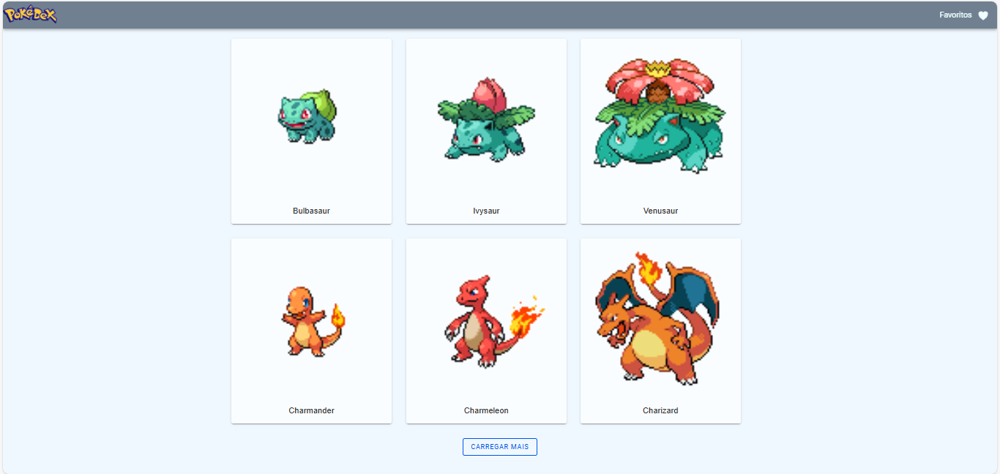
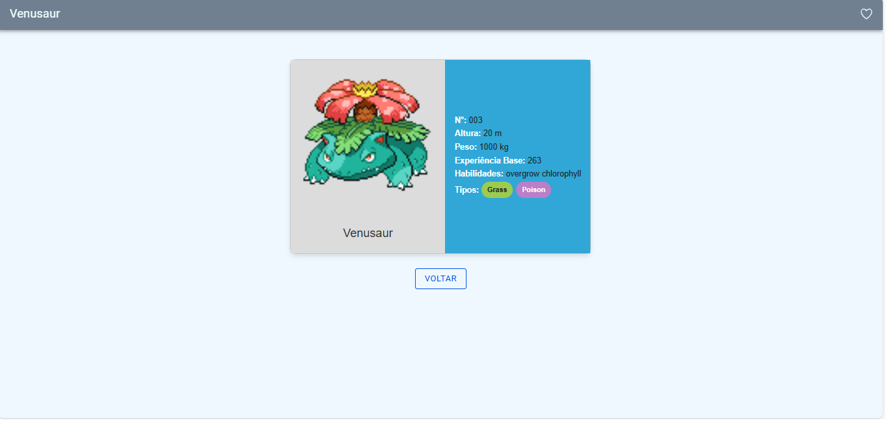
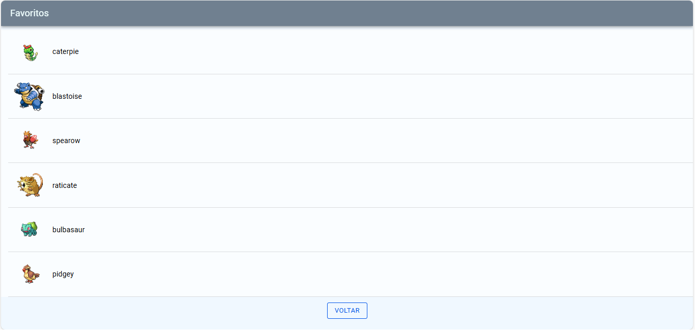

# PokeAPI

Este é um projeto desenvolvido em Angular que consome a API do Pokémon ([https://pokeapi.co/](https://pokeapi.co/)). O objetivo deste projeto é permitir que os usuários visualizem uma lista de pokémons, vejam os detalhes de cada pokémon e possam favoritá-los.

## Configuração do Ambiente de Desenvolvimento

Para executar este projeto localmente, siga estas etapas:

1. Certifique-se de ter o Node.js e o Angular CLI instalados em seu ambiente de desenvolvimento.
2. Clone este repositório em sua máquina local.
3. No diretório raiz do projeto, execute o seguinte comando para instalar as dependências:

```bash
npm install
```

4. Após a instalação das dependências, você pode iniciar o servidor de desenvolvimento com o seguinte comando:

```bash
npm start
```

5. O aplicativo estará disponível em `http://localhost:4200/` por padrão. Você pode acessar este URL em seu navegador para visualizar o aplicativo.

## Funcionalidades

O aplicativo possui as seguintes funcionalidades:

1. **Lista de Pokémons**: Exibe uma lista de pokémons com seus nomes e imagens.




2. **Detalhes do Pokémon**: Permite visualizar os detalhes de cada pokémon, incluindo altura, peso, experiência base e habilidades.



3. **Favoritos**: Permite aos usuários favoritar seus pokémons favoritos e visualizar uma lista dos pokémons favoritos.




## Estrutura do Projeto

O projeto está estruturado da seguinte forma:

- **src/app/**: Contém os componentes Angular utilizados no projeto, como `home`, `details` e `favorite-list`.
- **src/app/models**: Contém as definições de modelos TypeScript utilizados para representar os dados do Pokémon.
- **src/app/services**: Contém os serviços Angular utilizados para buscar dados da API do Pokémon e gerenciar os favoritos.

## Testes de Unidade

Os testes podem ser executados usando o seguinte comando:

```bash
npm test
```

## Dependências Externas

Este projeto utiliza as seguintes dependências externas:

- **Angular**: Framework JavaScript para construção de aplicações web.
- **Ionic**: Framework de UI para construção de aplicativos móveis híbridos.
- **RxJS**: Biblioteca para programação reativa em JavaScript.
- **HttpClientModule**: Módulo Angular para realizar requisições HTTP.
- **Jasmine**: Framework de testes para JavaScript.
- **Karma**: Test runner para executar testes JavaScript em diversos navegadores.